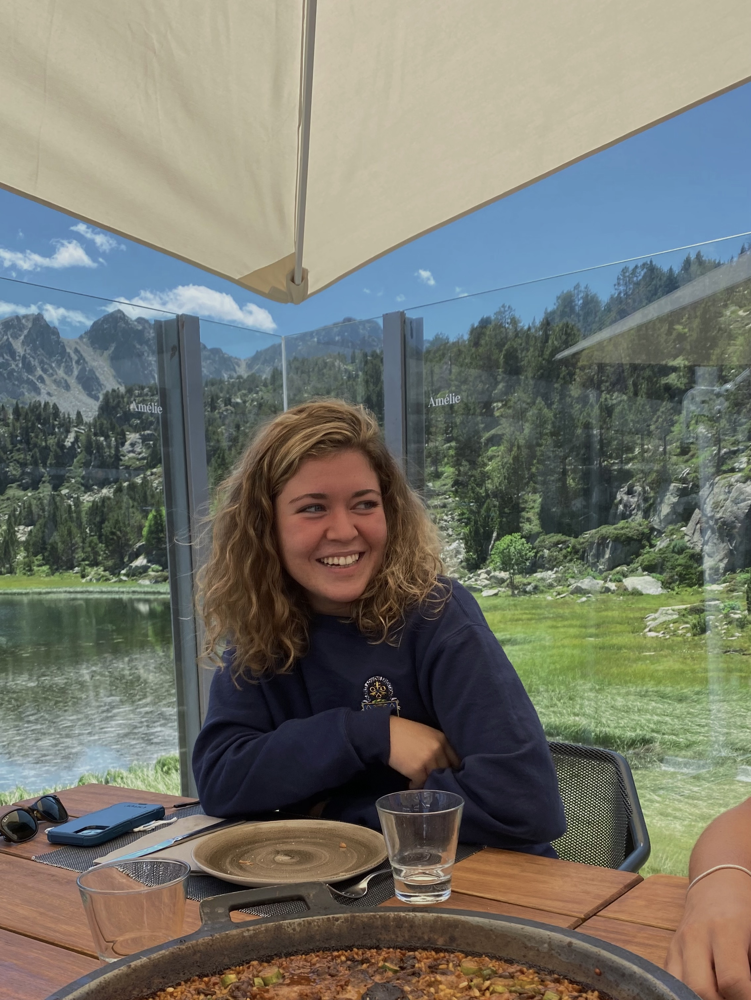

# DATA150

## Evolving Solutions: Human Development/Data Science

# Introduction 

Hi I'm Miriam Burch and live in Northern Virginia, however; I'm half Spanish, half American and was born and raised in Belgium.  I'm majoring in International Relations through the William and Mary St Andrews Joint Degree Programme and have an interest in learning how culture, politics and economics impact the global system.  I've been sailing for 13 years and love to travel with family/friends.  An interesting fact about me is that I spent my first 4th of July in the States last summer!
 

#  Informal Responses

1. [9/7 Joshua Blumenstock](blumenstock.md)

2. [9/9 Hans Rosling](hansrosling.md)

3. [9/21 Owen Barder](owenbarder.md)

4. [9/23 Gettysburg Address & Human Development](humandevelopment.md)

5. [9/28 Get To Know Me](gettoknowme.md)

6. [9/30 Gapminder](gapminderessay.md)

7. [10/7 Our World In Data](ourworldindataessay.md)

8. [10/12 China BRI](chinasplan.md)

9. [10/21 Data on Abundance](dataonabundance.md)

10. [10/28 What is Data Science?](1028essay.md)

11. [11/2 HDI](112essay.md)

12. [11/4 Recommendation](114essay.md)

14. [11/9 Facial Recognition](119essay.md)

15. [11/11 COVID Effects](1111essay.md)

16. [11/16 Self-Driving Vehicles](1116essay.md)

# Formal Responses

1. [Annotated Bibliography](annotatedbibliography.md)

2. [Literature Review](literaturereview.md) 

3. [Methodological Investigation](results.md)

4. [Research Proposal](researchproposal.html)

